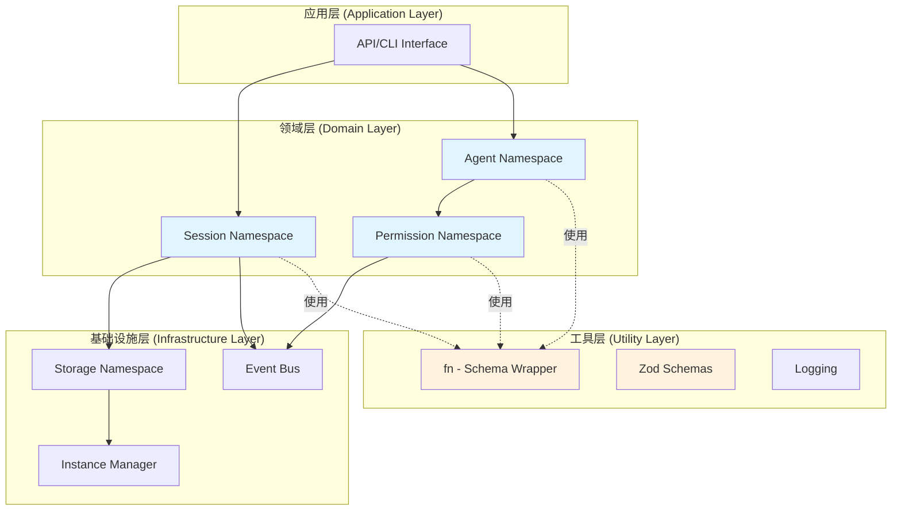
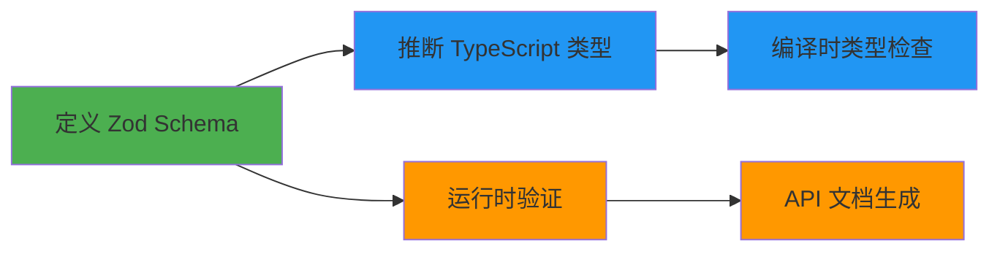
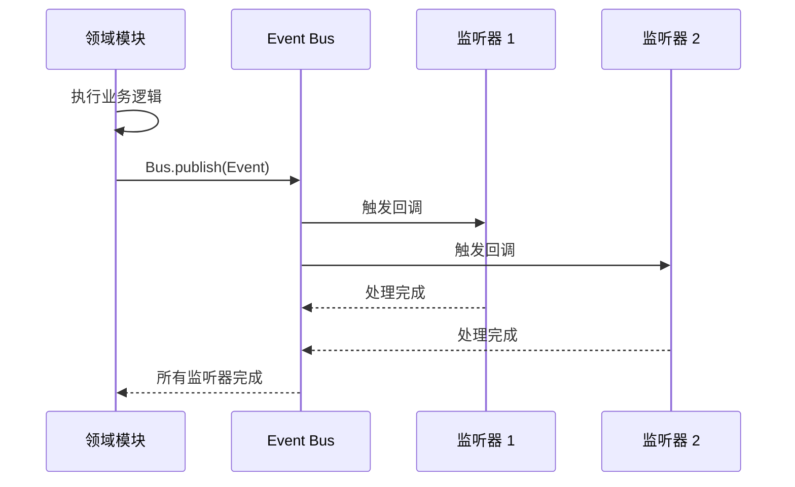
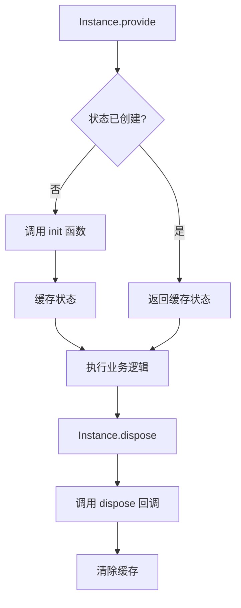
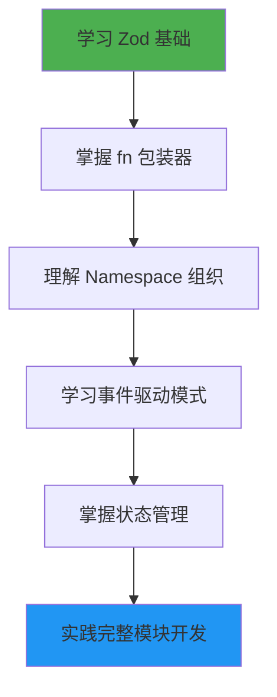

# OpenCode 开发范式学习指南

> 深入理解 OpenCode 项目所采用的函数式 + 类型安全的 TypeScript 开发范式

## 目录

- [1. 核心理念](#1-核心理念)
- [2. 架构模式总览](#2-架构模式总览)
- [3. Namespace 模块化组织](#3-namespace-模块化组织)
- [4. 函数式编程模式](#4-函数式编程模式)
- [5. Zod 驱动的类型系统](#5-zod-驱动的类型系统)
- [6. 事件驱动架构](#6-事件驱动架构)
- [7. 状态管理模式](#7-状态管理模式)
- [8. 实战案例](#8-实战案例)
- [9. 最佳实践指南](#9-最佳实践指南)

---

## 1. 核心理念

OpenCode 采用了一种混合式的开发范式，主要特征包括：

### 1.1 函数式优先 (Functional First)

- **数据与行为分离**：数据结构通过 Zod schema 定义，操作函数独立存在
- **纯函数设计**：大部分函数不依赖外部状态，易于测试和推理
- **不可变数据**：避免直接修改数据，通过函数转换产生新数据
- **函数组合**：使用 pipe、compose 等高阶函数构建复杂逻辑

### 1.2 类型安全至上 (Type Safety First)

- **运行时 + 编译时验证**：Zod 提供运行时类型检查，TypeScript 提供编译时检查
- **Schema 驱动开发**：所有数据结构先定义 Zod schema，然后推断 TypeScript 类型
- **严格的输入验证**：所有对外接口都经过 schema 验证

### 1.3 模块化组织 (Namespace-based Modularity)

- **Namespace 封装**：使用 TypeScript Namespace 组织相关功能
- **单一职责**：每个 namespace 专注一个领域
- **明确的导出**：精确控制 API 暴露面

---

## 2. 架构模式总览



### 2.1 层次职责

| 层次 | 职责 | 示例 |
|------|------|------|
| **应用层** | 对外接口，用户交互 | CLI 命令、HTTP API |
| **领域层** | 业务逻辑，领域模型 | Session、Agent、Permission |
| **基础设施层** | 数据持久化、事件通信 | Storage、Bus、Instance |
| **工具层** | 通用工具，类型验证 | fn 包装器、Zod schemas |

---

## 3. Namespace 模块化组织

### 3.1 基本结构

```typescript
// 典型的 Namespace 结构
export namespace Session {
  // 1. 内部依赖
  const log = Log.create({ service: "session" })
  
  // 2. 数据 Schema 定义
  export const Info = z.object({
    id: Identifier.schema("session"),
    title: z.string(),
    // ... 更多字段
  }).meta({ ref: "Session" })
  
  export type Info = z.output<typeof Info>
  
  // 3. 事件定义
  export const Event = {
    Created: BusEvent.define("session.created", z.object({ info: Info })),
    Updated: BusEvent.define("session.updated", z.object({ info: Info })),
  }
  
  // 4. 导出函数
  export const create = fn(
    z.object({ title: z.string().optional() }).optional(),
    async (input) => { /* 实现 */ }
  )
  
  export const get = fn(
    Identifier.schema("session"),
    async (id) => { /* 实现 */ }
  )
  
  // 5. 内部函数 (不导出)
  async function createNext(input: { /* ... */ }) {
    // 内部实现细节
  }
}
```

### 3.2 为什么使用 Namespace？

**优势对比**：

| 组织方式 | 优势 | 劣势 | 适用场景 |
|---------|------|------|---------|
| **Namespace** | • 单文件集中<br>• 清晰的命名空间<br>• 易于导入 | • 文件可能较大<br>• 不支持 tree-shaking | 库、工具、领域模块 |
| **ES6 Module** | • 细粒度导入<br>• 更好的代码分割 | • 需要管理多文件<br>• 导入路径复杂 | 应用代码、组件 |
| **Class** | • OOP 封装<br>• 继承多态 | • 状态管理复杂<br>• 测试困难 | 框架、服务类 |

**OpenCode 选择 Namespace 的原因**：
- ✅ **单一入口**：`Session.create()` 比 `import { create } from './session/create'` 更简洁
- ✅ **命名空间隔离**：避免命名冲突
- ✅ **类型聚合**：`Session.Info` 类型与相关函数在同一命名空间

### 3.3 实战示例：创建一个 Namespace 模块

```typescript
import z from "zod"
import { fn } from "@/util/fn"
import { Storage } from "@/storage/storage"
import { BusEvent } from "@/bus/bus-event"
import { Bus } from "@/bus"

// 假设我们要创建一个 Task 模块
export namespace Task {
  // 1. 定义 Schema
  export const Info = z.object({
    id: z.string(),
    title: z.string(),
    status: z.enum(["pending", "completed", "cancelled"]),
    createdAt: z.number(),
    completedAt: z.number().optional(),
  }).meta({ ref: "Task" })
  
  export type Info = z.output<typeof Info>
  
  // 2. 定义事件
  export const Event = {
    Created: BusEvent.define(
      "task.created",
      z.object({ task: Info })
    ),
    StatusChanged: BusEvent.define(
      "task.status_changed",
      z.object({ taskId: z.string(), newStatus: Info.shape.status })
    ),
  }
  
  // 3. CRUD 操作
  export const create = fn(
    z.object({
      title: z.string().min(1),
    }),
    async (input) => {
      const task: Info = {
        id: generateId(),
        title: input.title,
        status: "pending",
        createdAt: Date.now(),
      }
      
      await Storage.write(["task", task.id], task)
      Bus.publish(Event.Created, { task })
      
      return task
    }
  )
  
  export const get = fn(
    z.string(), // taskId
    async (id) => {
      return Storage.read<Info>(["task", id])
    }
  )
  
  export const complete = fn(
    z.string(), // taskId
    async (id) => {
      return Storage.update<Info>(["task", id], (draft) => {
        draft.status = "completed"
        draft.completedAt = Date.now()
      })
    }
  )
  
  // 4. 查询函数
  export async function* list() {
    for (const key of await Storage.list(["task"])) {
      const task = await Storage.read<Info>(key).catch(() => undefined)
      if (task) yield task
    }
  }
  
  // 5. 内部辅助函数 (不导出)
  function generateId() {
    return `task_${Date.now()}_${Math.random().toString(36).slice(2)}`
  }
}
```

---

## 4. 函数式编程模式

### 4.1 fn 包装器 - 核心抽象

OpenCode 的 `fn` 工具是整个架构的核心，它将 Zod schema 验证与函数执行结合：

```typescript
// fn 的实现
export function fn<T extends z.ZodType, Result>(
  schema: T,
  cb: (input: z.infer<T>) => Result
) {
  const result = (input: z.infer<T>) => {
    const parsed = schema.parse(input)  // 运行时验证
    return cb(parsed)
  }
  result.force = (input: z.infer<T>) => cb(input)  // 绕过验证
  result.schema = schema  // 暴露 schema 用于文档生成
  return result
}
```

**使用示例**：

```typescript
// 定义带验证的函数
const createUser = fn(
  z.object({
    name: z.string().min(2),
    email: z.string().email(),
    age: z.number().min(0).max(150),
  }),
  async (input) => {
    // input 已经被验证，类型安全
    console.log(`Creating user: ${input.name}`)
    return { id: generateId(), ...input }
  }
)

// 调用时自动验证
const user = await createUser({
  name: "Alice",
  email: "alice@example.com",
  age: 30,
})

// 无效输入会抛出 ZodError
try {
  await createUser({ name: "A", email: "invalid", age: -1 })
} catch (e) {
  // ZodError with detailed validation errors
}

// 绕过验证（用于内部调用）
const user2 = await createUser.force({ name: "Bob", email: "bob@example.com", age: 25 })

// 访问 schema（用于文档生成、API schema 等）
console.log(createUser.schema.shape.name._def.typeName) // ZodString
```

### 4.2 函数组合 (Pipe Pattern)

```typescript
import { pipe, values, sortBy, filter } from "remeda"

// OpenCode 中的实际例子
export async function list() {
  const cfg = await Config.get()
  return pipe(
    await state(),           // 1. 获取原始数据
    values(),                // 2. 提取值
    filter(x => !x.hidden),  // 3. 过滤隐藏项
    sortBy([
      x => x.name === cfg.default_agent,
      "desc"
    ])                       // 4. 排序
  )
}
```

**自己实现 pipe**：

```typescript
type PipeFunction = <T>(value: T) => any

function pipe<T>(
  initial: T,
  ...fns: PipeFunction[]
): any {
  return fns.reduce((value, fn) => fn(value), initial)
}

// 使用示例
const result = pipe(
  [1, 2, 3, 4, 5],
  (arr) => arr.map(x => x * 2),      // [2, 4, 6, 8, 10]
  (arr) => arr.filter(x => x > 5),   // [6, 8, 10]
  (arr) => arr.reduce((a, b) => a + b, 0)  // 24
)
```

### 4.3 高阶函数模式

```typescript
// 1. 函数作为参数
export async function update(
  id: string,
  editor: (draft: Info) => void,  // 接收函数
  options?: { touch?: boolean }
) {
  return Storage.update<Info>(["session", id], (draft) => {
    editor(draft)  // 执行用户提供的编辑函数
    if (options?.touch !== false) {
      draft.time.updated = Date.now()
    }
  })
}

// 使用
await update(sessionId, (session) => {
  session.title = "New Title"
  session.status = "active"
})

// 2. 函数作为返回值（柯里化）
function createValidator<T>(schema: z.ZodType<T>) {
  return (value: unknown): value is T => {
    return schema.safeParse(value).success
  }
}

const isUser = createValidator(z.object({
  name: z.string(),
  age: z.number(),
}))

if (isUser(data)) {
  // TypeScript 知道 data 是 { name: string, age: number }
  console.log(data.name)
}
```

### 4.4 生成器函数 (Async Generators)

```typescript
// OpenCode 中的实际例子
export async function* list() {
  const project = Instance.project
  for (const item of await Storage.list(["session", project.id])) {
    const session = await Storage.read<Info>(item).catch(() => undefined)
    if (!session) continue
    yield session  // 逐个产出，内存友好
  }
}

// 使用
for await (const session of Session.list()) {
  console.log(session.title)
  // 可以提前 break，不会加载所有数据
  if (session.id === targetId) break
}

// 转换为数组（慎用，可能内存占用大）
const allSessions = []
for await (const session of Session.list()) {
  allSessions.push(session)
}
```

**为什么使用生成器？**
- ✅ **惰性求值**：只在需要时计算下一项
- ✅ **内存效率**：不需要一次性加载所有数据
- ✅ **流式处理**：支持大数据集

---

## 5. Zod 驱动的类型系统

### 5.1 Schema First 开发流程



### 5.2 Schema 定义模式

```typescript
import z from "zod"

// 1. 基础 Schema
export const UserSchema = z.object({
  id: z.string().uuid(),
  name: z.string().min(1).max(100),
  email: z.string().email(),
  age: z.number().int().positive().max(150).optional(),
  role: z.enum(["admin", "user", "guest"]),
  metadata: z.record(z.string(), z.any()),
  createdAt: z.number(),
}).meta({ ref: "User" })  // 添加元数据用于代码生成

export type User = z.output<typeof UserSchema>

// 2. Schema 复用与组合
const TimestampSchema = z.object({
  createdAt: z.number(),
  updatedAt: z.number(),
})

const AuthorSchema = z.object({
  userId: z.string(),
  userName: z.string(),
})

export const PostSchema = z.object({
  id: z.string(),
  title: z.string(),
  content: z.string(),
  author: AuthorSchema,  // 嵌套 Schema
  time: TimestampSchema,
})

// 3. Schema 变换
const CreateUserInput = UserSchema.omit({ id: true, createdAt: true })
const UpdateUserInput = UserSchema.partial().required({ id: true })
const UserSummary = UserSchema.pick({ id: true, name: true, email: true })

// 4. Schema 继承/扩展
const AdminUserSchema = UserSchema.extend({
  permissions: z.array(z.string()),
  department: z.string(),
})

// 5. 联合类型 Schema
const EventSchema = z.discriminatedUnion("type", [
  z.object({ type: z.literal("user.created"), user: UserSchema }),
  z.object({ type: z.literal("user.deleted"), userId: z.string() }),
  z.object({ type: z.literal("user.updated"), userId: z.string(), changes: z.record(z.any()) }),
])

type Event = z.infer<typeof EventSchema>
// Event 是 discriminated union，TypeScript 可以正确推断
```

### 5.3 运行时验证 vs 编译时类型

```typescript
// 编译时：TypeScript 检查
function processUser(user: User) {
  console.log(user.name)  // ✅ TypeScript 知道 name 存在
  console.log(user.xyz)   // ❌ TypeScript 报错
}

// 运行时：Zod 验证
const rawData = await fetchFromAPI("/user/123")

// 不安全的做法（仅编译时检查）
const user = rawData as User  // 😱 如果 API 返回数据格式错误？

// 安全的做法（运行时 + 编译时）
const user = UserSchema.parse(rawData)  // ✅ 运行时验证，类型安全

// 更安全的做法（处理错误）
const result = UserSchema.safeParse(rawData)
if (result.success) {
  const user = result.data  // 类型安全的 User
  console.log(user.name)
} else {
  console.error("Validation failed:", result.error.issues)
}
```

### 5.4 Schema 驱动的 API 设计

```typescript
// 1. 定义输入输出 Schema
const CreateTaskInput = z.object({
  title: z.string().min(1).max(200),
  description: z.string().max(2000).optional(),
  priority: z.enum(["low", "medium", "high"]),
  tags: z.array(z.string()).max(10),
})

const TaskResponse = z.object({
  id: z.string(),
  title: z.string(),
  status: z.enum(["pending", "in_progress", "completed"]),
  createdAt: z.number(),
})

// 2. 使用 fn 包装器创建 API
export const createTask = fn(
  CreateTaskInput,
  async (input) => {
    // input 已验证
    const task = {
      id: generateId(),
      ...input,
      status: "pending" as const,
      createdAt: Date.now(),
    }
    
    await Storage.write(["task", task.id], task)
    return TaskResponse.parse(task)  // 验证返回值
  }
)

// 3. 自动生成 API 文档
/*
POST /api/tasks
Request Body:
{
  "title": string (1-200 chars),
  "description": string (optional, max 2000 chars),
  "priority": "low" | "medium" | "high",
  "tags": string[] (max 10 items)
}

Response:
{
  "id": string,
  "title": string,
  "status": "pending" | "in_progress" | "completed",
  "createdAt": number
}
*/
```

---

## 6. 事件驱动架构

### 6.1 事件系统设计



### 6.2 事件定义模式

```typescript
// 1. 定义事件
import { BusEvent } from "@/bus/bus-event"

export namespace Session {
  export const Info = z.object({ /* ... */ })
  
  export const Event = {
    Created: BusEvent.define(
      "session.created",
      z.object({ info: Info })
    ),
    Updated: BusEvent.define(
      "session.updated",
      z.object({ info: Info })
    ),
    Deleted: BusEvent.define(
      "session.deleted",
      z.object({ info: Info })
    ),
  }
}

// 2. 发布事件
export const create = fn(
  CreateSessionInput,
  async (input) => {
    const session = await createNext(input)
    
    // 发布事件
    Bus.publish(Session.Event.Created, {
      info: session
    })
    
    return session
  }
)

// 3. 监听事件
Bus.subscribe(Session.Event.Created, async (event) => {
  console.log(`New session created: ${event.info.id}`)
  
  // 执行副作用
  await sendNotification({
    type: "session_created",
    sessionId: event.info.id,
  })
})

Bus.subscribe(Session.Event.Created, async (event) => {
  // 另一个独立的监听器
  await updateAnalytics({
    event: "session_created",
    timestamp: Date.now(),
  })
})
```

### 6.3 BusEvent 实现原理

```typescript
// BusEvent 的核心实现
export namespace BusEvent {
  const registry = new Map<string, Definition>()
  
  export function define<Type extends string, Properties extends ZodType>(
    type: Type,
    properties: Properties
  ) {
    const result = {
      type,
      properties,  // Zod schema
    }
    registry.set(type, result)
    return result
  }
  
  // 生成包含所有事件的联合类型
  export function payloads() {
    return z.discriminatedUnion(
      "type",
      registry.entries()
        .map(([type, def]) => {
          return z.object({
            type: z.literal(type),
            properties: def.properties,
          })
        })
        .toArray() as any
    )
  }
}
```

### 6.4 实战：构建完整的事件系统

```typescript
// 定义事件
export namespace Order {
  export const Info = z.object({
    id: z.string(),
    userId: z.string(),
    items: z.array(z.object({
      productId: z.string(),
      quantity: z.number(),
      price: z.number(),
    })),
    total: z.number(),
    status: z.enum(["pending", "paid", "shipped", "delivered", "cancelled"]),
  })
  
  export const Event = {
    Created: BusEvent.define("order.created", z.object({ order: Info })),
    Paid: BusEvent.define("order.paid", z.object({ orderId: z.string(), amount: z.number() })),
    Shipped: BusEvent.define("order.shipped", z.object({ orderId: z.string(), trackingNumber: z.string() })),
  }
  
  // 创建订单
  export const create = fn(
    z.object({ userId: z.string(), items: Info.shape.items }),
    async (input) => {
      const order: z.infer<typeof Info> = {
        id: generateId(),
        ...input,
        total: calculateTotal(input.items),
        status: "pending",
      }
      
      await Storage.write(["order", order.id], order)
      Bus.publish(Event.Created, { order })
      
      return order
    }
  )
  
  // 支付订单
  export const pay = fn(
    z.object({ orderId: z.string(), paymentMethod: z.string() }),
    async (input) => {
      const order = await Storage.update<z.infer<typeof Info>>(
        ["order", input.orderId],
        (draft) => { draft.status = "paid" }
      )
      
      Bus.publish(Event.Paid, {
        orderId: order.id,
        amount: order.total,
      })
      
      return order
    }
  )
}

// 设置监听器
// 1. 订单创建后发送确认邮件
Bus.subscribe(Order.Event.Created, async (event) => {
  const { order } = event
  await sendEmail({
    to: await getUserEmail(order.userId),
    subject: "Order Confirmation",
    body: `Your order #${order.id} has been created.`,
  })
})

// 2. 订单支付后更新库存
Bus.subscribe(Order.Event.Paid, async (event) => {
  const order = await Order.get(event.orderId)
  for (const item of order.items) {
    await Inventory.decrease(item.productId, item.quantity)
  }
})

// 3. 订单支付后创建发货任务
Bus.subscribe(Order.Event.Paid, async (event) => {
  await Shipping.createTask({
    orderId: event.orderId,
    priority: "normal",
  })
})
```

---

## 7. 状态管理模式

### 7.1 Instance-Scoped State

OpenCode 使用 `Instance.state` 创建作用域状态：

```typescript
// 状态创建模式
export namespace Agent {
  const state = Instance.state(async () => {
    const cfg = await Config.get()
    
    // 初始化状态
    const result: Record<string, Info> = {
      build: { /* ... */ },
      plan: { /* ... */ },
    }
    
    // 应用用户配置
    for (const [key, value] of Object.entries(cfg.agent ?? {})) {
      if (value.disable) {
        delete result[key]
        continue
      }
      // ... 合并配置
    }
    
    return result
  })
  
  // 使用状态
  export async function get(agent: string) {
    return state().then(x => x[agent])
  }
  
  export async function list() {
    return pipe(
      await state(),
      values(),
      sortBy([...])
    )
  }
}
```

### 7.2 状态生命周期



### 7.3 实战：实现自己的状态管理

```typescript
// 简化版的 Instance.state 实现
export class StateManager {
  private cache = new Map<string, any>()
  
  create<S>(
    keyFn: () => string,
    init: () => S | Promise<S>,
    dispose?: (state: Awaited<S>) => Promise<void>
  ) {
    return () => {
      const key = keyFn()
      if (!this.cache.has(key)) {
        const promise = Promise.resolve(init())
        this.cache.set(key, promise)
      }
      return this.cache.get(key) as S
    }
  }
  
  async dispose(key: string) {
    const state = this.cache.get(key)
    if (state && state.dispose) {
      await state.dispose()
    }
    this.cache.delete(key)
  }
}

// 使用示例
const stateManager = new StateManager()

export namespace Database {
  const state = stateManager.create(
    () => "database",
    async () => {
      console.log("Initializing database connection...")
      const connection = await createConnection()
      return {
        connection,
        queryCount: 0,
      }
    },
    async (state) => {
      console.log("Closing database connection...")
      await state.connection.close()
    }
  )
  
  export async function query(sql: string) {
    const db = await state()
    db.queryCount++
    return db.connection.query(sql)
  }
  
  export async function getStats() {
    const db = await state()
    return { queryCount: db.queryCount }
  }
}
```

---

## 8. 实战案例

### 8.1 完整示例：构建一个 Note 模块

```typescript
import z from "zod"
import { fn } from "@/util/fn"
import { Storage } from "@/storage/storage"
import { BusEvent } from "@/bus/bus-event"
import { Bus } from "@/bus"
import { Identifier } from "@/id/id"
import { Instance } from "@/project/instance"

/**
 * Note 模块 - 笔记管理系统
 * 展示 OpenCode 范式的完整应用
 */
export namespace Note {
  // ==================== 1. Schema 定义 ====================
  
  export const Info = z.object({
    id: Identifier.schema("note"),
    title: z.string().min(1).max(200),
    content: z.string().max(100000),
    tags: z.array(z.string()).max(20),
    createdAt: z.number(),
    updatedAt: z.number(),
    authorId: z.string(),
    isPublic: z.boolean().default(false),
    metadata: z.record(z.string(), z.any()).optional(),
  }).meta({ ref: "Note" })
  
  export type Info = z.output<typeof Info>
  
  // 输入 Schema
  const CreateInput = Info.pick({
    title: true,
    content: true,
    tags: true,
  }).extend({
    authorId: z.string(),
    isPublic: z.boolean().optional(),
  })
  
  const UpdateInput = Info.partial().required({ id: true })
  
  // ==================== 2. 事件定义 ====================
  
  export const Event = {
    Created: BusEvent.define(
      "note.created",
      z.object({ note: Info })
    ),
    Updated: BusEvent.define(
      "note.updated",
      z.object({
        noteId: z.string(),
        changes: z.record(z.string(), z.any()),
      })
    ),
    Deleted: BusEvent.define(
      "note.deleted",
      z.object({ noteId: z.string() })
    ),
    TagAdded: BusEvent.define(
      "note.tag_added",
      z.object({ noteId: z.string(), tag: z.string() })
    ),
  }
  
  // ==================== 3. 状态管理 ====================
  
  const state = Instance.state(async () => {
    return {
      cache: new Map<string, Info>(),
      searchIndex: new Map<string, Set<string>>(), // tag -> noteIds
    }
  })
  
  // ==================== 4. CRUD 操作 ====================
  
  export const create = fn(
    CreateInput,
    async (input) => {
      const note: Info = {
        id: Identifier.ascending("note"),
        title: input.title,
        content: input.content,
        tags: input.tags,
        authorId: input.authorId,
        isPublic: input.isPublic ?? false,
        createdAt: Date.now(),
        updatedAt: Date.now(),
      }
      
      // 持久化
      await Storage.write(["note", note.id], note)
      
      // 更新缓存
      const s = await state()
      s.cache.set(note.id, note)
      
      // 更新搜索索引
      for (const tag of note.tags) {
        if (!s.searchIndex.has(tag)) {
          s.searchIndex.set(tag, new Set())
        }
        s.searchIndex.get(tag)!.add(note.id)
      }
      
      // 发布事件
      Bus.publish(Event.Created, { note })
      
      return note
    }
  )
  
  export const get = fn(
    Identifier.schema("note"),
    async (id) => {
      // 先查缓存
      const s = await state()
      if (s.cache.has(id)) {
        return s.cache.get(id)!
      }
      
      // 从存储读取
      const note = await Storage.read<Info>(["note", id])
      s.cache.set(id, note)
      return note
    }
  )
  
  export const update = fn(
    UpdateInput,
    async (input) => {
      const { id, ...changes } = input
      
      const note = await Storage.update<Info>(
        ["note", id],
        (draft) => {
          Object.assign(draft, changes)
          draft.updatedAt = Date.now()
        }
      )
      
      // 更新缓存
      const s = await state()
      s.cache.set(id, note)
      
      // 发布事件
      Bus.publish(Event.Updated, {
        noteId: id,
        changes,
      })
      
      return note
    }
  )
  
  export const remove = fn(
    Identifier.schema("note"),
    async (id) => {
      await Storage.remove(["note", id])
      
      // 清除缓存
      const s = await state()
      s.cache.delete(id)
      
      // 清除搜索索引
      for (const noteIds of s.searchIndex.values()) {
        noteIds.delete(id)
      }
      
      // 发布事件
      Bus.publish(Event.Deleted, { noteId: id })
    }
  )
  
  // ==================== 5. 查询操作 ====================
  
  export async function* list(options?: {
    authorId?: string
    isPublic?: boolean
    tag?: string
  }) {
    const s = await state()
    
    for (const key of await Storage.list(["note"])) {
      const note = await Storage.read<Info>(key).catch(() => undefined)
      if (!note) continue
      
      // 应用过滤器
      if (options?.authorId && note.authorId !== options.authorId) continue
      if (options?.isPublic !== undefined && note.isPublic !== options.isPublic) continue
      if (options?.tag && !note.tags.includes(options.tag)) continue
      
      yield note
    }
  }
  
  export const findByTag = fn(
    z.string(),
    async (tag) => {
      const s = await state()
      const noteIds = s.searchIndex.get(tag)
      if (!noteIds) return []
      
      const notes: Info[] = []
      for (const id of noteIds) {
        const note = await get(id)
        notes.push(note)
      }
      return notes
    }
  )
  
  export const search = fn(
    z.object({
      query: z.string(),
      tags: z.array(z.string()).optional(),
      authorId: z.string().optional(),
    }),
    async (input) => {
      const results: Info[] = []
      
      for await (const note of list({
        authorId: input.authorId,
      })) {
        // 搜索标题和内容
        const matchesQuery = !input.query || 
          note.title.toLowerCase().includes(input.query.toLowerCase()) ||
          note.content.toLowerCase().includes(input.query.toLowerCase())
        
        // 匹配标签
        const matchesTags = !input.tags || 
          input.tags.every(tag => note.tags.includes(tag))
        
        if (matchesQuery && matchesTags) {
          results.push(note)
        }
      }
      
      return results
    }
  )
  
  // ==================== 6. 辅助函数 ====================
  
  export const addTag = fn(
    z.object({
      noteId: Identifier.schema("note"),
      tag: z.string().min(1).max(50),
    }),
    async (input) => {
      const note = await get(input.noteId)
      
      if (note.tags.includes(input.tag)) {
        return note // 已存在
      }
      
      const updated = await update({
        id: input.noteId,
        tags: [...note.tags, input.tag],
      })
      
      // 更新搜索索引
      const s = await state()
      if (!s.searchIndex.has(input.tag)) {
        s.searchIndex.set(input.tag, new Set())
      }
      s.searchIndex.get(input.tag)!.add(input.noteId)
      
      Bus.publish(Event.TagAdded, {
        noteId: input.noteId,
        tag: input.tag,
      })
      
      return updated
    }
  )
  
  export async function getStats() {
    let total = 0
    let publicCount = 0
    const tagCounts = new Map<string, number>()
    
    for await (const note of list()) {
      total++
      if (note.isPublic) publicCount++
      
      for (const tag of note.tags) {
        tagCounts.set(tag, (tagCounts.get(tag) || 0) + 1)
      }
    }
    
    return {
      total,
      publicCount,
      privateCount: total - publicCount,
      tags: Array.from(tagCounts.entries())
        .map(([tag, count]) => ({ tag, count }))
        .sort((a, b) => b.count - a.count),
    }
  }
}

// ==================== 7. 事件监听器 ====================

// 自动备份新创建的笔记
Bus.subscribe(Note.Event.Created, async (event) => {
  await backup({
    type: "note",
    id: event.note.id,
    data: event.note,
  })
})

// 日志记录
Bus.subscribe(Note.Event.Updated, async (event) => {
  console.log(`Note ${event.noteId} updated:`, event.changes)
})

// 清理删除的笔记的相关资源
Bus.subscribe(Note.Event.Deleted, async (event) => {
  // 删除相关附件、评论等
  await cleanupResources(event.noteId)
})
```

### 8.2 使用 Note 模块

```typescript
// 创建笔记
const note = await Note.create({
  title: "OpenCode 学习笔记",
  content: "今天学习了 OpenCode 的开发范式...",
  tags: ["编程", "TypeScript", "OpenCode"],
  authorId: "user_123",
  isPublic: true,
})

// 查询笔记
const myNote = await Note.get(note.id)

// 更新笔记
await Note.update({
  id: note.id,
  title: "OpenCode 深度学习笔记",
  content: myNote.content + "\n\n补充内容...",
})

// 添加标签
await Note.addTag({
  noteId: note.id,
  tag: "函数式编程",
})

// 搜索笔记
const results = await Note.search({
  query: "OpenCode",
  tags: ["TypeScript"],
})

// 列表查询（流式）
for await (const note of Note.list({ authorId: "user_123" })) {
  console.log(note.title)
}

// 按标签查找
const typescriptNotes = await Note.findByTag("TypeScript")

// 获取统计信息
const stats = await Note.getStats()
console.log(`Total notes: ${stats.total}`)
console.log(`Top tags:`, stats.tags.slice(0, 5))

// 删除笔记
await Note.remove(note.id)
```

---

## 9. 最佳实践指南

### 9.1 模块组织原则

#### ✅ DO: 按领域组织

```typescript
// ✅ 好的做法
export namespace User {
  export const Info = z.object({ /* ... */ })
  export const create = fn(/* ... */)
  export const get = fn(/* ... */)
  export const update = fn(/* ... */)
}

export namespace Session {
  export const Info = z.object({ /* ... */ })
  export const create = fn(/* ... */)
  export const get = fn(/* ... */)
}
```

#### ❌ DON'T: 按技术层次组织

```typescript
// ❌ 不好的做法
export namespace Schemas {
  export const User = z.object({ /* ... */ })
  export const Session = z.object({ /* ... */ })
}

export namespace Queries {
  export const getUser = fn(/* ... */)
  export const getSession = fn(/* ... */)
}
```

### 9.2 函数设计原则

#### ✅ DO: 单一职责，小而专注

```typescript
// ✅ 好的做法
export const create = fn(
  CreateInput,
  async (input) => {
    const entity = await createNext(input)
    Bus.publish(Event.Created, { entity })
    return entity
  }
)

async function createNext(input: z.infer<typeof CreateInput>) {
  // 内部实现细节
  const entity = {
    id: generateId(),
    ...input,
    createdAt: Date.now(),
  }
  await Storage.write(["entity", entity.id], entity)
  return entity
}
```

#### ❌ DON'T: 函数做太多事情

```typescript
// ❌ 不好的做法
export const createAndNotifyAndLog = fn(
  CreateInput,
  async (input) => {
    const entity = { id: generateId(), ...input, createdAt: Date.now() }
    await Storage.write(["entity", entity.id], entity)
    await sendEmail(/* ... */)
    await logToAnalytics(/* ... */)
    await updateCache(/* ... */)
    return entity
  }
)
```

### 9.3 Schema 设计原则

#### ✅ DO: 精确的类型约束

```typescript
// ✅ 好的做法
const Email = z.string().email()
const Age = z.number().int().positive().max(150)
const Username = z.string().min(3).max(20).regex(/^[a-zA-Z0-9_]+$/)
const Status = z.enum(["active", "inactive", "suspended"])
```

#### ❌ DON'T: 过于宽松的类型

```typescript
// ❌ 不好的做法
const Email = z.string()
const Age = z.number()
const Username = z.string()
const Status = z.string()
```

### 9.4 错误处理原则

#### ✅ DO: 使用类型化的错误

```typescript
// ✅ 好的做法
import { NamedError } from "@opencode-ai/util/error"

export const NotFoundError = NamedError.create(
  "NotFoundError",
  z.object({
    message: z.string(),
    resourceId: z.string(),
  })
)

export const get = fn(
  z.string(),
  async (id) => {
    const result = await Storage.read(["entity", id])
    if (!result) {
      throw new NotFoundError({
        message: `Entity ${id} not found`,
        resourceId: id,
      })
    }
    return result
  }
)

// 调用方可以捕获特定错误
try {
  await Entity.get("nonexistent")
} catch (e) {
  if (e instanceof NotFoundError) {
    console.error(`Resource not found: ${e.resourceId}`)
  } else {
    throw e
  }
}
```

### 9.5 性能优化原则

#### ✅ DO: 使用生成器处理大数据

```typescript
// ✅ 好的做法
export async function* list() {
  for (const key of await Storage.list(["entity"])) {
    const entity = await Storage.read(key)
    yield entity
  }
}

// 使用时可以提前退出
for await (const entity of Entity.list()) {
  if (entity.id === targetId) {
    return entity  // 不会加载所有数据
  }
}
```

#### ❌ DON'T: 一次性加载所有数据

```typescript
// ❌ 不好的做法（如果数据量大）
export async function list() {
  const keys = await Storage.list(["entity"])
  const entities = await Promise.all(
    keys.map(key => Storage.read(key))
  )
  return entities  // 内存占用大
}
```

### 9.6 测试友好设计

#### ✅ DO: 依赖注入，易于 mock

```typescript
// ✅ 好的做法
export namespace User {
  export const create = fn(
    CreateInput,
    async (input, deps = { storage: Storage, bus: Bus }) => {
      const user = { id: generateId(), ...input }
      await deps.storage.write(["user", user.id], user)
      deps.bus.publish(Event.Created, { user })
      return user
    }
  )
}

// 测试时可以注入 mock
const mockStorage = {
  write: vi.fn(),
}
const mockBus = {
  publish: vi.fn(),
}

await User.create(
  { name: "Alice" },
  { storage: mockStorage, bus: mockBus }
)

expect(mockStorage.write).toHaveBeenCalledWith(
  ["user", expect.any(String)],
  expect.objectContaining({ name: "Alice" })
)
```

### 9.7 文档化原则

#### ✅ DO: 添加 JSDoc 注释

```typescript
/**
 * 创建新用户
 * 
 * @example
 * ```typescript
 * const user = await User.create({
 *   name: "Alice",
 *   email: "alice@example.com",
 *   role: "user",
 * })
 * ```
 * 
 * @throws {ValidationError} 如果输入数据无效
 * @throws {DuplicateError} 如果邮箱已存在
 * 
 * @fires User.Event.Created 用户创建成功后触发
 */
export const create = fn(
  CreateInput,
  async (input) => {
    // ... 实现
  }
)
```

---

## 10. 迁移指南：从 OOP 到 FP

### 10.1 Class → Namespace

**Before (OOP)**:
```typescript
class UserService {
  private logger: Logger
  private db: Database
  
  constructor(db: Database, logger: Logger) {
    this.db = db
    this.logger = logger
  }
  
  async createUser(data: CreateUserDTO): Promise<User> {
    this.logger.info("Creating user", data)
    const user = await this.db.users.create(data)
    return user
  }
  
  async getUser(id: string): Promise<User | null> {
    return this.db.users.findOne({ id })
  }
}

// 使用
const service = new UserService(db, logger)
const user = await service.createUser({ name: "Alice" })
```

**After (FP + Namespace)**:
```typescript
export namespace User {
  const log = Log.create({ service: "user" })
  
  export const Info = z.object({
    id: z.string(),
    name: z.string(),
  })
  export type Info = z.output<typeof Info>
  
  export const create = fn(
    z.object({ name: z.string() }),
    async (input) => {
      log.info("Creating user", input)
      const user = {
        id: generateId(),
        ...input,
      }
      await Storage.write(["user", user.id], user)
      return user
    }
  )
  
  export const get = fn(
    z.string(),
    async (id) => {
      return Storage.read<Info>(["user", id])
    }
  )
}

// 使用
const user = await User.create({ name: "Alice" })
```

### 10.2 继承 → 组合

**Before (OOP)**:
```typescript
class BaseService {
  protected db: Database
  
  constructor(db: Database) {
    this.db = db
  }
  
  protected async save(entity: any) {
    return this.db.save(entity)
  }
}

class UserService extends BaseService {
  async createUser(data: any) {
    const user = { ...data, id: generateId() }
    return this.save(user)
  }
}
```

**After (FP + 组合)**:
```typescript
// 共享函数
async function save<T>(key: string[], entity: T) {
  await Storage.write(key, entity)
  return entity
}

export namespace User {
  export const create = fn(
    CreateInput,
    async (input) => {
      const user = { id: generateId(), ...input }
      return save(["user", user.id], user)  // 复用
    }
  )
}

export namespace Post {
  export const create = fn(
    CreateInput,
    async (input) => {
      const post = { id: generateId(), ...input }
      return save(["post", post.id], post)  // 复用
    }
  )
}
```

---

## 11. 常见问题 FAQ

### Q1: 为什么不用 Class？

**A**: OpenCode 选择 Namespace + 函数式的原因：
- ✅ **更简单的心智模型**：不需要考虑 `this`、继承、多态
- ✅ **更容易测试**：纯函数易于单元测试
- ✅ **更好的类型推断**：TypeScript 对函数的类型推断优于类
- ✅ **避免状态管理问题**：没有实例状态，避免共享可变状态的问题

### Q2: Schema First vs Type First？

**A**: Schema First 的优势：
- ✅ **运行时安全**：永远不要相信外部输入
- ✅ **自动生成文档**：从 schema 生成 API 文档
- ✅ **统一的真相源**：schema 即是类型也是验证器
- ✅ **更好的错误信息**：Zod 提供详细的验证错误

### Q3: 何时使用 fn 包装器？

**A**: 
- ✅ **对外接口**：所有暴露的 API 都应该用 fn 包装
- ✅ **需要验证的函数**：接受外部输入的函数
- ❌ **内部辅助函数**：纯内部使用的函数可以不包装

```typescript
// ✅ 对外 API
export const create = fn(CreateInput, async (input) => { /* ... */ })

// ❌ 内部函数
function generateId() {
  return `id_${Date.now()}`
}
```

### Q4: 如何处理复杂的业务逻辑？

**A**: 使用函数组合 + 事件驱动：

```typescript
// 1. 拆分为小函数
async function validateInput(input: any) { /* ... */ }
async function createEntity(input: any) { /* ... */ }
async function sendNotification(entity: any) { /* ... */ }

// 2. 组合
export const create = fn(
  CreateInput,
  async (input) => {
    await validateInput(input)
    const entity = await createEntity(input)
    
    // 3. 用事件处理副作用
    Bus.publish(Event.Created, { entity })
    
    return entity
  }
)

// 4. 副作用在事件监听器中处理
Bus.subscribe(Event.Created, async (event) => {
  await sendNotification(event.entity)
})
```

---

## 12. 总结

### 核心要点

1. **Namespace 组织模块**：按领域组织，不按技术层次
2. **fn 包装器**：所有对外函数都用 fn 包装，提供运行时验证
3. **Zod Schema First**：先定义 schema，再推断类型
4. **事件驱动**：用事件解耦副作用
5. **纯函数优先**：避免副作用，易于测试
6. **生成器处理流**：用 async generator 处理大数据集
7. **状态作用域化**：用 Instance.state 管理作用域状态

### 学习路径



### 下一步

1. **实践项目**：用这种范式重写一个小项目
2. **阅读源码**：深入阅读 OpenCode 的其他模块
3. **贡献代码**：尝试为 OpenCode 贡献功能

---

## 参考资源

- [Zod 官方文档](https://zod.dev/)
- [TypeScript Handbook - Namespaces](https://www.typescriptlang.org/docs/handbook/namespaces.html)
- [Functional Programming in TypeScript](https://github.com/gcanti/fp-ts)
- [Remeda - Functional Utility Library](https://remedajs.com/)

---

**Created**: 2026-02-03  
**Version**: 1.0  
**Author**: OpenCode Learning Guide
